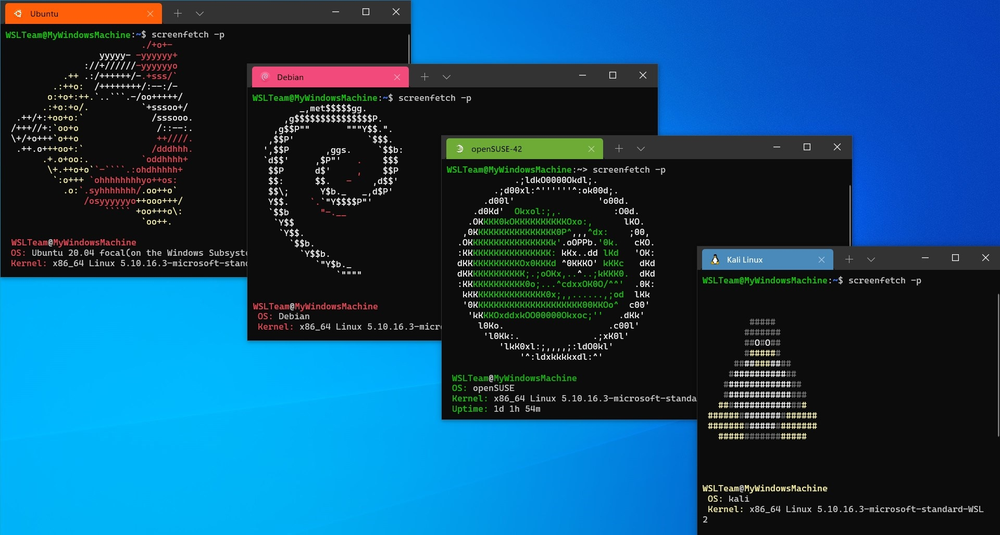

# WSL



## What is WSL?

WSL (Windows Subsystem for Linux) is a compatibility layer for running Linux binary executables natively on Windows 10 and Windows 11.
It allows users to run a Linux environment directly on Windows, without the need for a virtual machine or dual-boot setup.
WSL provides a Linux-compatible kernel interface developed by Microsoft, which allows users to run Linux applications and tools on Windows.
This is particularly useful for developers, system administrators, and anyone who needs to use Linux tools while working on a Windows machine.

## Why use WSL?
As you may have noticed, most of the tools we use in CTFs are designed for Linux.
While you can use a virtual machine to run Linux on your Windows machine, WSL offers a more seamless and efficient way to access Linux tools without the overhead of a full virtual machine.
With WSL, you can run Linux commands and applications directly from your Windows command prompt or terminal, making it easier to switch between Windows and Linux environments.
Additionally, WSL allows you to access your Windows files from the Linux environment, making it easier to work with files across both systems.
Overall, WSL is a powerful tool for anyone who needs to use Linux tools on a Windows machine, and it can greatly enhance your productivity when working on CTF challenges that require Linux tools.

## Installation

### Prerequisites
- Windows 10 version 2004 and later (Build 19041 and later), or Windows 11

### Installation Steps
To install WSL on your Windows machine, follow these steps:

1. Open PowerShell as an administrator by right-clicking on the Start button and selecting "Windows PowerShell (Admin)".
2. Run the following command to install WSL with all necessary features and a default Linux distribution (Ubuntu):
   ```
   wsl --install
   ```
3. Restart your computer when prompted.
4. After restarting, the WSL installation will complete automatically. The first time you launch the installed Linux distribution, a console window will open. Wait for the files to be extracted and stored on your computer.
5. You will be prompted to create a new user account and password for the Linux environment.
6. After setting up your user account, you can start using the Linux terminal to run commands and access Linux tools.

### Changing the Default Distribution
By default, Ubuntu is installed. To install a different distribution, you can:
- View available distributions: `wsl --list --online`
- Install a specific distribution: `wsl --install -d <DistroName>` (for example, `wsl --install -d Ubuntu`)

### Official Resources
For more detailed information and advanced configuration options, refer to the official [`Microsoft documentation`](https://learn.microsoft.com/en-us/windows/wsl/install).
