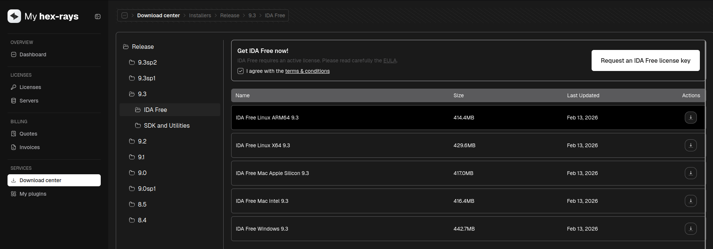

# IDA

As we mentioned, reverse engineering is all about analyzing programs and understanding what they do.
But you may ask yourself: "How can I do that if I don't have the source code?"
Here comes IDA, or any other **disassembler**.

## What is a disassembler?

A disassembler is a program that takes a compiled program and converts it into assembly code.
Then, some advanced disassemblers (like IDA) also try to convert the "not-so-readable" assembly code
into pseudo-code (i.e., C code) to make it easier to understand.

We honestly recommend IDA over Ghidra or others because, even with the free version, it offers a more readable and complete 
pseudo-code. However, you should know the basics of Ghidra too, since sometimes you might be forced to use it because it
works <u>offline</u> too.

## Installation

In this section, we will provide a brief tutorial on how to *install* IDA.

First, visit [https://hex-rays.com/](https://hex-rays.com/) and create an account.
Click on *My Account* and enter your email, then enter the code that they send you.

After that, you'll be presented with your dashboard; click on the "Download center" on the left menu.
Now just select the version of IDA you want to download (e.g., directory 9.x/IDA Free) and click on the download icon for the 
program compatible with your OS (Linux, Mac, Windows).

You shoud see something like this.

While in that same section, click on the "Request an IDA free license key" button and then go in the "License"
section to download your free license key for IDA.

We suggest putting the license key somewhere safe (at least where you won't delete it accidentally).

After you download IDA and the license key, simply run the IDA installer and then open IDA itself. 

When you're prompted to enter a license, just fill in the field with your license path.

