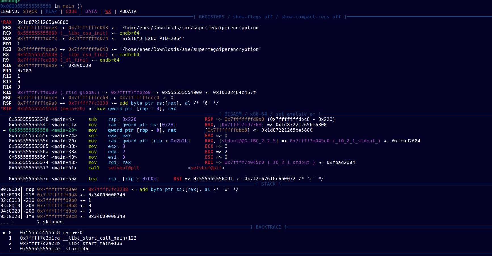

# GDB

Another way to analyze binaries is by doing it <u>dynamically</u>.
Basically, you're watching exactly what the program does while it's actually running, 
instead of just staring at its static code. 
This whole process is known as **debugging**, and tools like **GDB** are here to help you get the job done.

## What can a debugger do?

A debugger lets you dive deep into a program and see what's actually happening under the hood.
You can do cool stuff like *inspecting* or even *straight-up modifying* **memory** while the program is running.


## Installation

The default `gdb` installation is really easy, but you either need to have a Linux OS or use WSL (Windows Subsystem for Linux) 
that you can learn about here -> [WSL-docs](/docs/miscellaneous/wsl).  
To install it, you can just use your package manager (apt, dnf, ...).  
On a Debian-based distribution, you can just run in your terminal:
```bash
sudo apt update
sudo apt install gdb git python3 python3-pip
# you might as well install the other *software* that you'll need later
```

GDB is really powerful but honestly, if you don't use any *plugins*, the usage can become
kinda difficult. We sincerely recommend using the **pwndbg** plugin that is perfect for what we need to do (rev & pwn).

Here's how you can install the plugin:

```bash
git clone https://github.com/pwndbg/pwndbg
cd pwndbg
./setup.sh
```
The reason for choosing pwndbg over standard GDB is quite simple.

This is what `gdb` alone shows you:


And this is what `pwndbg` shows you:


The amount of information that pwndbg gives you is just **insane**.

## Basic Usage

Using *pwndbg* is pretty straightforward if you're just getting started,
but it can get pretty deep once you hit the advanced stuff.

First off, pick the binary you want to debug and make sure it's <u>executable</u>:

```bash
chmod +x [binary-name]
```

To fire up the debugger, just run:

```bash
gdb [binary-name]
```

Now you're in the **pwndbg shell** and you can start debugging!

The most important command is `break` (or just `b`), which lets you set a **breakpoint** at a function. Just type:
`b function-name`

After that, start the program by typing `run` (or `r`). The program will run until it hits that breakpoint you just set.

Once you've hit a breakpoint, you can step through the program <u>one assembly instruction at a time</u> using `ni` (short for **next instruction**).

You should see something like this:



The amount of info pwndbg throws at you can be overwhelming at first, but here's the explanation of each section:

-   Looking at the interface in your terminal (or the photo), the top section shows the **registers** (like `rax` or `rsi` in x86_64). 
    Registers are small, super-fast storage inside the CPU. You'll see a lot of hex values here, which are usually memory addresses 
    pointing to other data.


-   In the second section, pwndbg shows the **assembly code** of the function you're currently analyzing. On the left, you've got the 
    memory addresses, and in the middle is the actual assembly, including calls to other functions like `printf`.


-   The last big section is the **stack**. This is a chunk of memory where functions store temporary data (like local variables). 
    We'll dive deep into the stack in the [Stack section](/docs/binary-exploitation/stack.mdx).

## More advanced commands

With what you've read so far, you should be able to handle basic debugging.
But if you need to do something more specific, here are some other commands that'll probably be useful:

-   `stack` → with this command, you can analyze the stack in more detail. You can use `stack <number>`
    to decide how many "slots" of the stack you wanna look at.

-   `telescope` → you can pass an address to this command to see what values are in that memory  
    area using `telescope <address> <number>`. (you can just use **tel**).

-   `x` → short for *examine*, this lets you inspect memory addresses in some cool ways.
    The syntax is pretty simple: `x/<n><f> <address>`. `n` is the number of memory chunks you want to analyze.
    The format (`f`), on the other hand, is what makes this command so powerful. You can use `i` to make gdb
    interpret the memory as instructions, `s` for strings, or `x` for hexadecimal data. There are tons of formats
    for this command, but listing them all here would take forever.

-   `si` → this command is super similar to `ni`, but with one major difference. If the program makes a call to another function, 
    `ni` steps *over* it (running the whole function in the background). On the other hand, `si` (step instruction) 
    steps *into* the function so you can analyze it line by line.