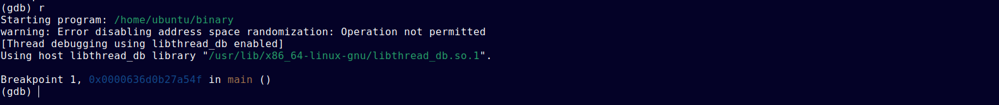
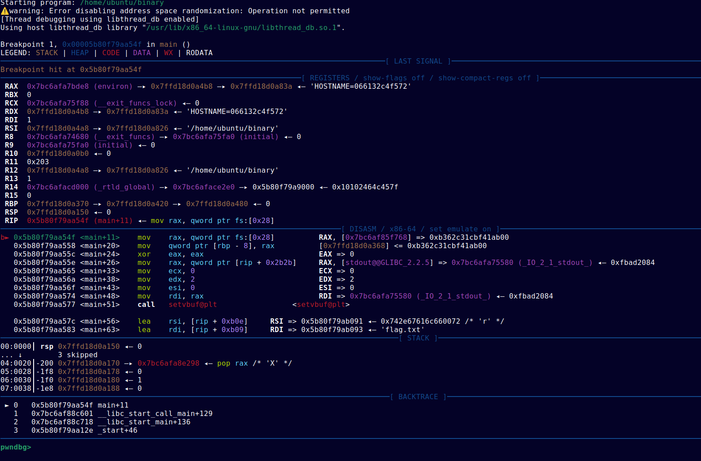

# GDB

Another way to analyze binaries is by doing it <u>dynamically</u>.
Basically, you're watching exactly what the program does while it's actually running, 
instead of just staring at its static code. 
This whole process is known as **debugging**, and tools like **GDB** are here to help you get the job done.

## What can a debugger do?

A debugger lets you dive deep into a program and see what's actually happening under the hood.
You can do cool stuff like *inspecting* or even *straight-up modifying* **memory** while the program is running.


## Installation

The default `gdb` installation is really easy, but you either need to have a Linux OS or use WSL (Windows Subsystem for Linux) 
that you can learn about here -> [WSL-docs](/docs/miscellaneous/wsl).  
To install it, you can just use your package manager (apt, dnf, ...).  
On a Debian-based distribution, you can just run in your terminal:
```bash

sudo apt update
sudo apt install gdb git python3 python3-pip
# you might as well install the other *software* that you'll need later

```

GDB is really powerful but honestly, if you don't use any *plugins*, the usage can become
kinda difficult. We sincerely recommend using the **pwndbg** plugin that is perfect for what we need to do (rev & pwn).

Here's how you can install the plugin:

```bash

git clone https://github.com/pwndbg/pwndbg
cd pwndbg
./setup.sh
```
The reason for choosing pwndbg over standard GDB is quite simple.

This is what `gdb` alone shows you:



And this is what `pwndbg` shows you:



The amount of information that pwndbg gives you is just **insane**.

## Basic Usage
