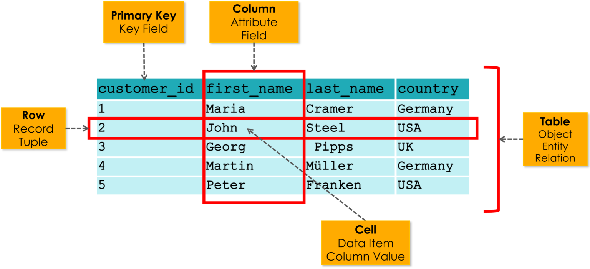
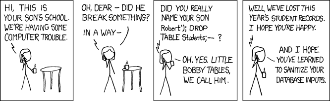

# What is SQL?
SQL is a structured query language. It is a standard language for managing and manipulating relational databases, like MySQL, PostgreSQL, SQLite, and Microsoft SQL Server.
It consists of a subset of commands that allow a user to perform CRUD operations on the data in a database, as well as create and modify the structure of a database.



In a database, we can therefore define main entities such as tables, which in turn are composed of columns and rows whose intersection results in cells containing scalar information, such as numbers, strings, or dates.

## SQL code
To utilize the features of this system, you need to use a few main keywords, which are listed below and explained to the extent necessary for CTFs.

### Create a table
To create a table, use the `CREATE TABLE` keyword followed by the table name and a series of columns enclosed in parentheses along with their respective data types.
```sql
CREATE TABLE table_name (
    column1 datatype,
    column2 datatype,
    column3 datatype
);
```
It should be noted that data types can be: 
* `INT` (Integer)
* `VARCHAR` (Variable Character)
* `DATE` (Date)
* `TEXT` (Text)
* `BOOLEAN` (Boolean)

### Insert a table
To insert data into a table, we use the `INSERT INTO` keyword followed by the table name and a series of columns enclosed in parentheses along with their respective values.
```sql
INSERT INTO table_name (column1, column2, column3) VALUES (value1, value2, value3);
```
This is intuitive, as it is similar to creating the table, but instead of defining the columns and their data types, we define the values we want to insert into the columns.

### Select a table
To select data from a table, use the `SELECT` keyword followed by the columns you want to select and the table name.
```sql
SELECT * FROM table_name;
```
It's also possible to use a condition to select specific rows from the table.
```sql
SELECT * FROM table_name WHERE column1 = value1;
```

### Update a table
To update data in a table, use the `UPDATE` keyword followed by the table name and a series of columns along with their respective values.
```sql
UPDATE table_name SET column1 = value1, column2 = value2 WHERE column3 = value3;
```
As in the previous cases, it's also possible to use a condition to update specific rows from the table.

### Delete a row
To delete a row from a table, use the `DELETE FROM` keyword followed by the table name and a condition.
```sql
DELETE FROM table_name WHERE column1 = value1;
```

### Drop a table
To drop a table, use the `DROP TABLE` keyword followed by the table name.
```sql
DROP TABLE table_name;
```

---

# What is an SQL Injection?
In cybersecurity we define SQL injection as an attack that takes advantage of the vulnerabilities in the code of an application, which can allow the attacker to execute arbitrary SQL queries on the database.
SQL Injection is one of the most common and dangerous web vulnerabilities, and it is ranked 5th in the [OWASP Top 10](https://owasp.org/Top10/2025/) list of the most critical web application security risks.
This is because SQL injection can allow attackers to bypass authentication, steal sensitive data, modify or delete data, and even take control of the entire database server.

## Example of an SQL Injection
Let's consider the following code that handles the login of a user in a web application.
```python
def login(username, password):
    query = f"SELECT * FROM users WHERE username = '{username}' AND password = '{password}'"
    # execute query
    cursor.execute(query)
    result = cursor.fetchone()
    if result:
        print("Login successful")
    else:
        print("Invalid credentials")
```


In this example, we can see that the `username` and `password` are concatenated directly into the SQL query. This is a major vulnerability, as it allows an attacker to inject arbitrary SQL code into the query.

For example, if an attacker enters the following username: `admin' --` and the following password: `admin`, the SQL query will become:

```sql
SELECT * FROM users WHERE username = 'admin' -- ' AND password = 'admin'
```

As you can see, the `--` operator comments out the rest of the query, effectively removing the password check. This allows the attacker to log in as admin without knowing the password.

# How to prevent SQL Injection?
When writing code to interact with a database, we should avoid using f-strings to format SQL queries. Instead, we should use **prepared statements**, which are the intended way to parameterize SQL queries.
This means that the value is passed separately from the query, ensuring that concatenation is never performed. As a result, there is no way for an attacker to manipulate the query. For instance, user input is treated strictly as data, rather than executable SQL code.

```python
def login(username, password):
    query = "SELECT * FROM users WHERE username = %s AND password = %s"
    cursor.execute(query, (username, password))
    result = cursor.fetchone()
    if result:
        print("Login successful")
    else:
        print("Invalid credentials")
```

